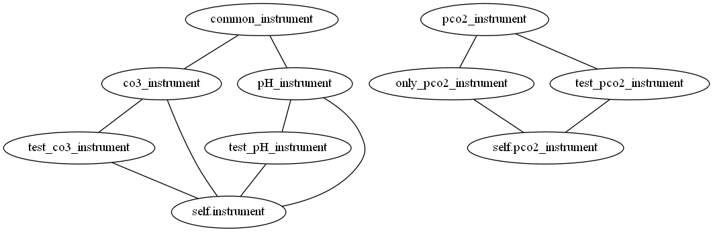
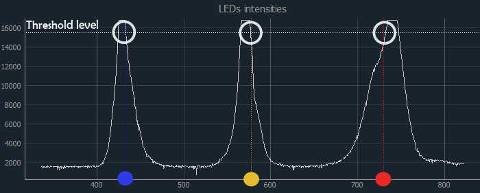

# pHox :fox_face:


### General description:
Software for operating automated systems for continuous measurements: 
* Miniature spectrophotometric detection system for measuring pH 
* Miniature spectrophotometric detection system for measuring CO<sub>3</sub>
* Miniature membrane based pCO<sub>2</sub> system

All systems are developed in NIVA either fully or in collaboration with other companies.
Different configurations of systems are installed on ships of opportunity. 
For simplicity, the miniature detection systems are called box systems 
since they are actually places in boxes. 

##### Supported box configurations
Most of the boxes measure only one parameter (pH, CO<sub>3</sub> or pCO<sub>2</sub>).
But one box includes systems both for pH and pCO<sub>2</sub> measurements (former CBON). 


Normally, the boxes are set up for automatically starting software. 
Boxes are preconfigured for using the needed version. 

### Program  description

##### Versions and libraries

The program is written on Python and should be used with versions >= python3.7 
For the GUI development we used PyQT library

*libraries*: pyQT, pyqtgraph

##### How to start the program manually: 

``` sudo python pHox_gui.py [OPTIONS]```  #append with needed options 

By default the program starts pH mode. 
Append the command line argument with parameters if you want to change the mode:
 
| Command     |   Description                                  |
|-------------|:-----------------------------------------------|
|--co3        | CO<sub>3</sub> mode                                       |
|--pco2       | pCO<sub>2</sub> + pH mode                                 |
|--onlypco2   | pCO<sub>2</sub>-only mode                                 |
|--localdev   | local development mode (**testing**)           |
|--debug      | show logging messages of debug level           |
|--nodye      | do not inject dye during sample (**testing**)  |
|--stability  | test stability of a spectrophotometer          |

#### How to install the code when using the new box 
1. pull this repository
``` git pull origin https://github.com/NIVANorge/pHox.git ```
2. run install3.sh
```sudo bash install3.sh```
3. create the file **box_id.txt** in your home directory
4. make sure that the configuration for you box is in configs/ folder, if it is not there, 
create it. 


##### Saving the data
 
After each measurement the data is saved locally (on raspberry pi) in the `data/` folder 
(See the local folder structure below) and sent to to main ferrybox 
computer via UDP. Later it is sent to the FTP server and injected to the database on the Google Cloud. 


The folder `spt/` contains files with raw spectra: raw dark, blank and number of light measurements. 
Also measurements are taken in repetitions.Spt files have all of them. 

The `evl/` folder contains pH values calculated for each measurement (for number of repetitions) and coefficient, 
other parameters used for calculation. 

pH.log file in the main `data/` folder is the file containing the final calculated and averaged pH values.
The file is updates after each measurement. 

This structure is for pH and CO3, both of them are spectrometric measurements. 

For pCO2, there is only pCO2.log 


 
 * spt,evl and log files description 
 


### Communication part
* Configuration files 
* Local testing 
* Measurement algorithm 
* Light source or LED, auto adjustment 
* Autostart and autostop 


* Communication with the spectrometer
* Communication with raspberri pi, valves, pumps
* Udp and ferrybox data 

### Logic desctiption 
* Logic and modes 
    * Continuous mode 
    * Single measurement mode
    * Calibration mode 
#### Auto Adjusting of light source or LEDs 
In order to make a pH measurement, we need a strong light signal. 
The light intensity on spectrophotometer should be close to Threshold value at 3 
defined wavelengths (NIR,HI,I2) for pH and one wavelength for CO3. 

 

Threshold depends on the maximum possible light intensity and depends on a Spectrophotometer type.

        "LIGHT_THRESHOLD_STS": 15500,            
        "LIGHT_THRESHOLD_FLAME": 60000  
        
The intensity can be regulated by changing the intensity of LEDs (or light source) can be regulated (values 0-100)
or by changing the spectrophotometer integration time. Both parameters can be changed 
either manually (using sliders in the Manual tab, int_time combobox in the config tab) or automatically.

In the configuration file, the option for auto adjusting is defined: it can be "ON", "OFF", 
or "ON_NORED"

        "Autoadjust_state": "ON"

If state is ON, then at each measurement, the autoadjust function will be run.        
if "ON_NORED" is chosen, only blue and green will be checked for pH. Red can be blocked by biofouling, 
but is not as important for the results as blue and yellow. For CO3, the regular autoadjust will happen for both 
"ON" and "ON_NORED" since the instensity for CO3 is controlled only by spectrophotometer integration time.

If state is 'ON' or 'ON_NORED', the autoAdjust_LED or autoAdjust_IntTime.
The code contains function for auto adjusting LED
Every time measurement is started (both in single measurement mode, single measurement mode 
and if auto adjust button is clicked), the autoadjust function will be triggered. 


Then, the options are also shown in  the GUI, in the config tab. 

### Graphical part description 
###### Classes structure for GUI panel create 


When you call the main module, pHox_gui.py, the main graphical panel is created. 
Depending on the options, it will be Panel_pH, Panel_PCO2_only or Panel_CO3
In these classes, all widgets, all timers are created.  

######  qss styles 
###### Live plotting

- [ ] 
#### TODO: Subthemes:

- [x] precisions
- [ ] asynchronous parts
 


 
