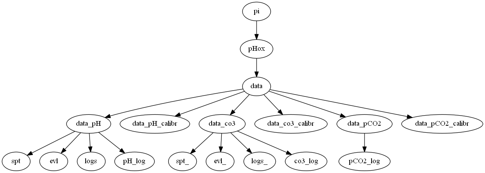

# pHox
Software for operating box instruments developed in NIVA.

* automated spectrophotometric measurements (pH and CO3)

#### supported box configurations:
* pH 
* pH + pCO2
* CO3
* pCO2

### Hot to use the program 
Normally, the boxes are set up for automatically starting software. If it does not happen, 
you can start it manually with: 

##### How to start the program manually: 

``` sudo python pHox_gui.py [OPTIONS]```  #append with needed options 

By default the program is starting pH mode. 
Append the command line argument with parameters if you want to change the mode:
 
* --pco2   # to run it in pco2 + pH mode
* --co3    # to run it in CO3 mode
* --onlypco2 # to run it in pCO2 mode 
* --debug  # to show logging messages of debug level (by default, only info level messages are shown)
* --localdev # to run the program in a local development mode (**only for testing**)
* --nodye  # do not inject dye during sample for not making a cuvette dirty (**only for testing**) 
* --stability # to test stability of a spectrophotometr. It this option is enabled,every time we get spectrum 
 to update the plot, this spectrum is also saved into sp_stability.log (**only for testing**)


### How to install the code when using the new box 
1. pull this repository
``` git pull origin https://github.com/NIVANorge/pHox.git ```
2. run install3.sh
```sudo bash install3.sh```
3. create the file **box_id.txt** in your home directory
4. make sure that the configuration for you box is in configs/ folder, if it is not there, 
create it. 


### Folder structure  
 
 
