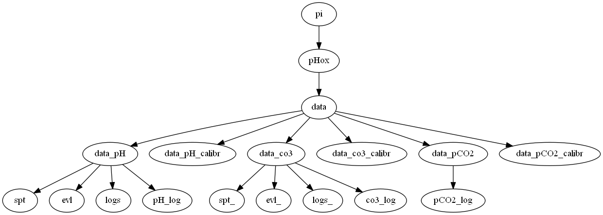
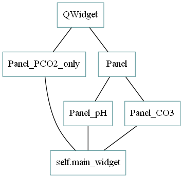
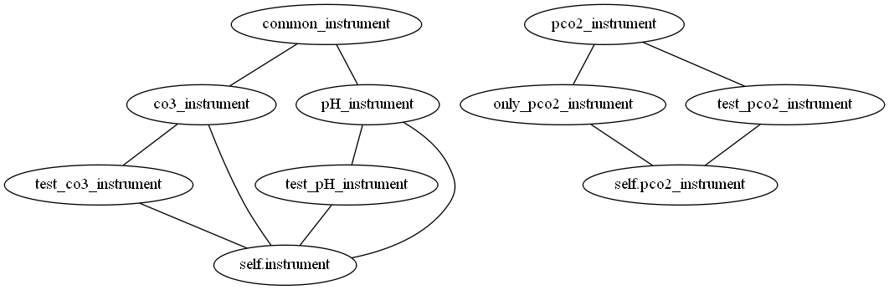
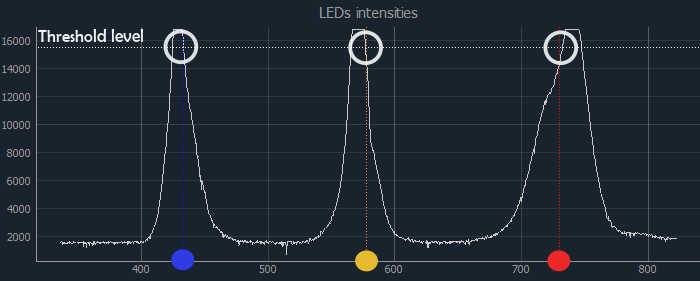

# pHox :fox_face:


### General description:
Software for operating automated systems for continuous measurements: 
* Miniature spectrophotometric detection system for measuring pH 
* Miniature spectrophotometric detection system for measuring CO<sub>3</sub>
* !OBS! Miniature membrane based pCO<sub>2</sub> system - moved to the separate repository https://github.com/NIVANorge/pCO2box  


All systems are developed in NIVA either fully or in collaboration with other companies.
Different configurations of systems are installed on ships of opportunity. 
For simplicity, the miniature detection systems are called box systems 
since they are actually places in boxes. 

### Supported box configurations
Most of the boxes measure only one parameter (pH, CO<sub>3</sub>).
But one box includes systems both for pH and pCO<sub>2</sub> measurements (former CBON). (not it use for now) 


Normally, the boxes are set up for automatically starting software. 
Boxes are preconfigured for using the needed version. 


### Program  description

##### Versions and libraries

The program is written on Python and should be used with versions >= python3.7 
For the GUI development we used PyQT library

*libraries*: pyQT, pyqtgraph

##### How to start the program manually: 

``` sudo python pHox_gui.py [OPTIONS]```  #append with needed options 


By default the program starts pH mode. 
Append the command line argument with parameters if you want to change the mode:
 
| Command     |   Description                                  |
|-------------|:-----------------------------------------------|
|--co3        | CO<sub>3</sub> mode                            |
|--pco2       | pCO<sub>2</sub> + pH mode                      |
|--localdev   | local development mode (**testing**)           |
|--debug      | show logging messages of debug level           |
|--nodye      | do not inject dye during sample (**testing**)  |
|--stability  | test stability of a spectrophotometer (**testing**)    |

#### How to install the code when using the new box 
1. pull this repository `git pull origin https://github.com/NIVANorge/pHox.git `
2. run install3.sh `sudo bash install3.sh`
3. create the file `box_id.txt` in your home directory `~/`
4. make sure that the configuration for you box is in `configs/` folder, if it is not there, 
create it. 

#### Logic and modes 
    * Continuous mode 
    * Single measurement mode
    * Calibration mode 
    * Local testing  

##### Saving the data
 
After each measurement the data is saved locally (on raspberry pi) in the `data/` folder 
(See the local folder structure below) and sent to to main ferrybox computer via UDP.
 Later it is sent to the FTP server and injected to the database on the Google Cloud. 

 

The folder `spt/` contains files with raw spectra: raw dark, blank and number of light measurements. 
Also measurements are taken in repetitions. `.spt` files have all of them. 
The `evl/` folder contains pH values calculated for each measurement (for number of repetitions) and coefficient, 
other parameters used for calculation. 
pH.log file in the main `data/` folder is the file containing the final calculated and averaged pH values.
The file is updates after each measurement. 

This structure is for pH and CO<sub>3</sub>, both of them are spectrometric measurements. 

## Classes structure



When you call the main module, pHox_gui.py, the main graphical panel is created. 
Depending on the options, it will be Panel_pH, or Panel_CO3
In these classes, all widgets, all timers are created.  

Gui class is a Main class. All other classes (for spectrophotometer and raspberry are depended on it)
Then from the main class, we create the instrument class 

pH_instrument and CO3_instrument are children classes for common instrument class.
They are are combined together because both of them use spectrophotometer. 


#### Communication between ferrybox computer, raspberry pi, instruments and spectrophotometers.

##### Ferrybox computer - Raspberry pi
module upd.py 

This communication is organized using UDP (User Datagram Protocol), 
it works in two directions (two separate processes): 
1) From FB computer to pHox
2) From pHox to FB computer. 

When the program is started, the Thread for udp messages is also starts. 
Every (time interval) the message from Ferrybox computer is sent to the pHox. 

String message from pHox to UDP consists of: 
* measurement code ( "$PCO3,", '$PPHOX' or "$PPCO2')
* measurement_string_version 

    (defined in the config file, helps to decode the message,"PCO3_string_version": "1") 
    
* string with data


##### Raspberry - Spectrophotometer 

In the code we use [python-seabreeze](https://github.com/ap--/python-seabreeze) - 
python wrapper for SeaBreeze (official library provided by Ocean Optics to communicate
with the spectrometers). It automatically detects connected spectrometer and providea a good
API for using spectrometer. 


ADCDifferentialPi, ADCDACPi, RPi.GPIO, pigpio for the communication with raspberry pi boards 


* Communication with the spectrometer
* Communication with raspberri pi, valves, pumps
* Udp and ferrybox data 

##### Configuration files 
Configuration file is located in the for you box is in `configs/` folder, if it is not there, 
create it. 


##### Measurement algorithm 

##### Autostart and autostop 

After creating the main widget, `self.main_widget.autorun()` is called. 
Inside the function, we check the mode for auto starting. 
1. Check if auto start is needed 

    `self._autostart` is a parameter from the configuration file. True if the autostart 
    mode should be working, False if no autostart is needed. Can be changed only by editing 
    the configuration file. 
    
2. Check auto start mode. 
  
    Pump mode is the only used mode for now. self.instrument._automode == 'pump'. 
    Here pump means, that the state of the program depends on the state of the 
    ferrybox system pump. The pump is stopped when ship is in port.
    ferrybox computer tracks the state of the pump and send it regularly to 
    the pHox box vie UDP. 
    
    ~~Starting by time is a legacy code, it is not used now and maybe need to be deleted.~~

       
#### Auto Adjusting of light source or LEDs 

In order to make a pH measurement, we need a strong light signal. 
The light intensity on spectrophotometer should be close to Threshold value at 3 
defined wavelengths (NIR,HI,I2) for pH and one wavelength for CO3. 

 

Threshold depends on the maximum possible light intensity and depends on a Spectrophotometer type.

        "LIGHT_THRESHOLD_STS": 15500,            
        "LIGHT_THRESHOLD_FLAME": 60000  
        
The intensity can be regulated by changing the intensity of LEDs (or light source) can be regulated (values 0-100)
or by changing the spectrophotometer integration time. Both parameters can be changed 
either manually (using sliders in the Manual tab, int_time combobox in the config tab) or automatically.

In the configuration file, the option for auto adjusting is defined: it can be `ON`, `OFF`, 
or `ON_NORED`

        "Autoadjust_state": "ON"

If state is ON, then at each measurement, the autoadjust function will be run.        
if `ON_NORED` is chosen, only blue and green will be checked for pH. Red can be blocked by biofouling, 
but is not as important for the results as blue and yellow. For CO<sub>3</sub>, the regular autoadjust will happen 
for both `ON` and `ON_NORED` since the intensity for CO<sub>3</sub> is controlled only by spectrophotometer 
integration time.

The code contains function `autoAdjust_LED` for auto intensity using LEDs (pH) and `autoAdjust_IntTime` 
for auto adjusting intensity by changing integration time of spectrophotometer (CO<sub>3</sub>).

The autoadjust function will be triggered every time measurement is started,if state is `ON` or `ON_NORED`.
(Both in single measurement mode, single measurement mode and if auto adjust button is clicked).


Then, the options are also shown in  the GUI, in the config tab. 

### Graphical part description 

######  qss styles 
All styles for the widgets are defined in style.qss


 


 
